# Group Project - USTH 2020

## Members
- Anh Duc DANG
- Truong Giang NGUYEN
- Le Tuan Duy NGUYEN

## Project info
Detect handsy stuff

## Classes
This is a guide to labeling the classes. Label as follows:  

### '0'
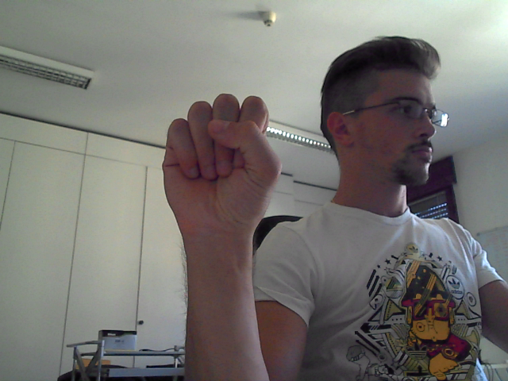

### '1'
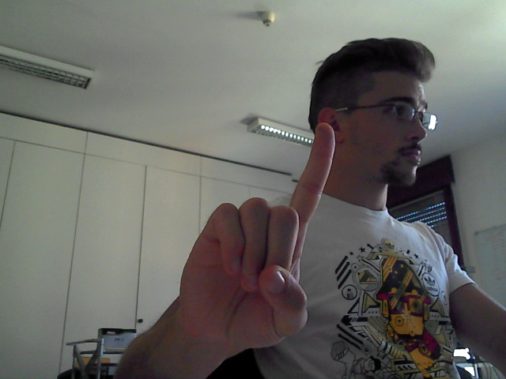

### '2'
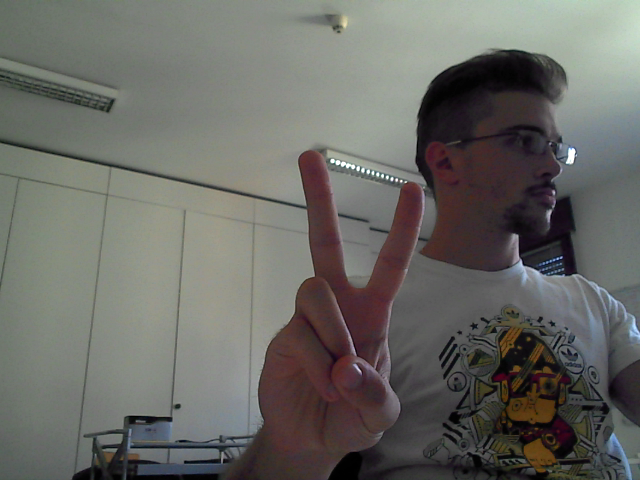

### '3'
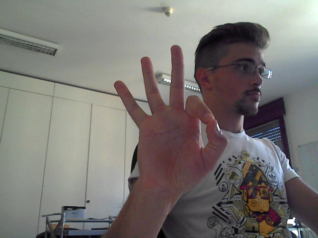  

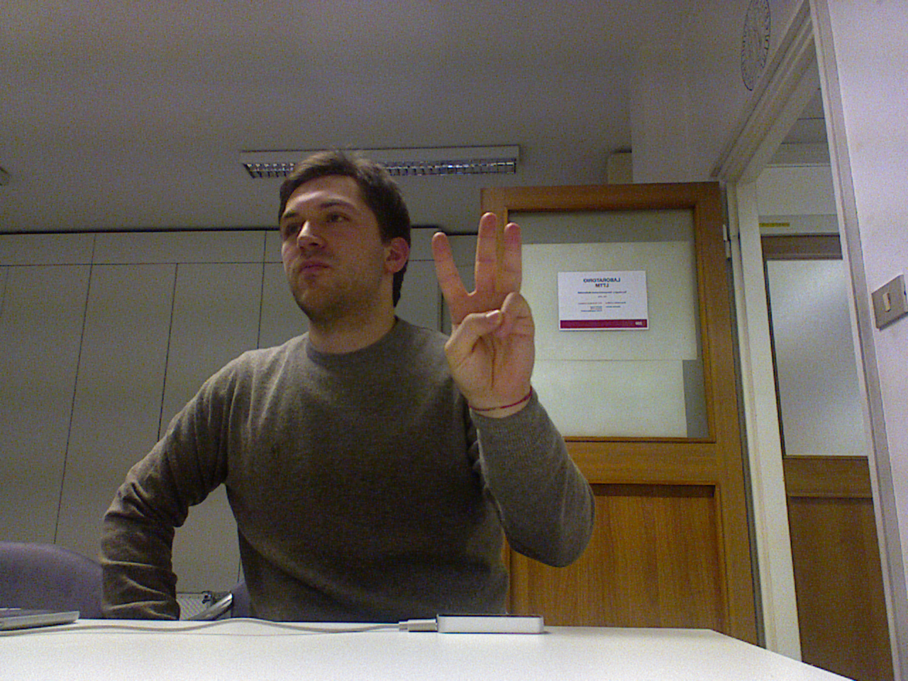

### '4'
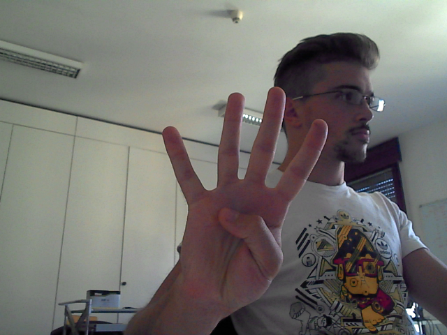

### '5'
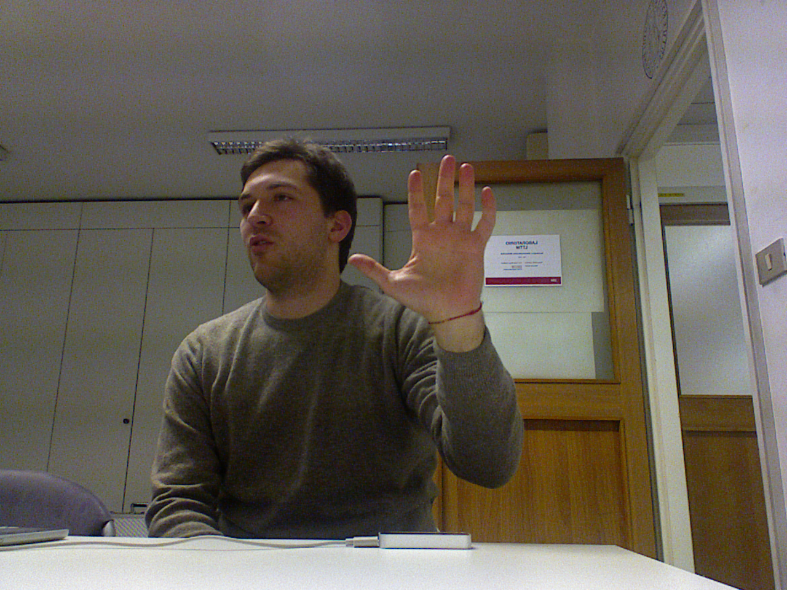

### 'hold'
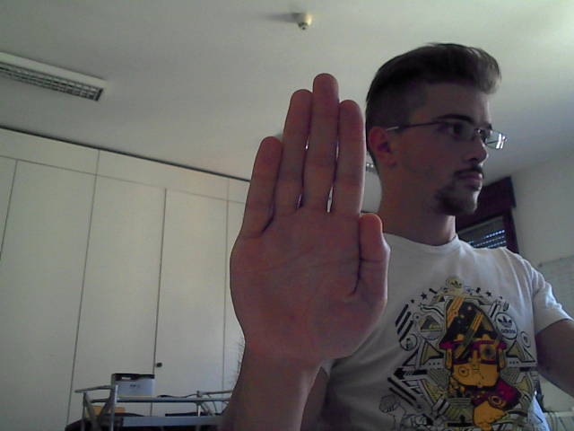

### 'left'
There are 2 left gesture using both left and right hand.  
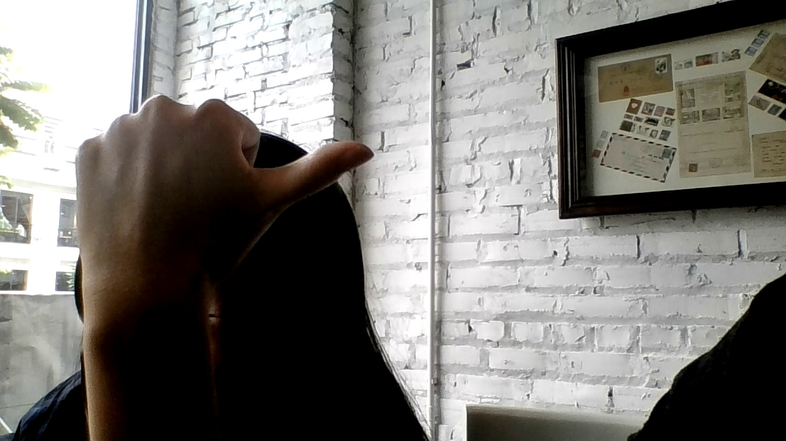
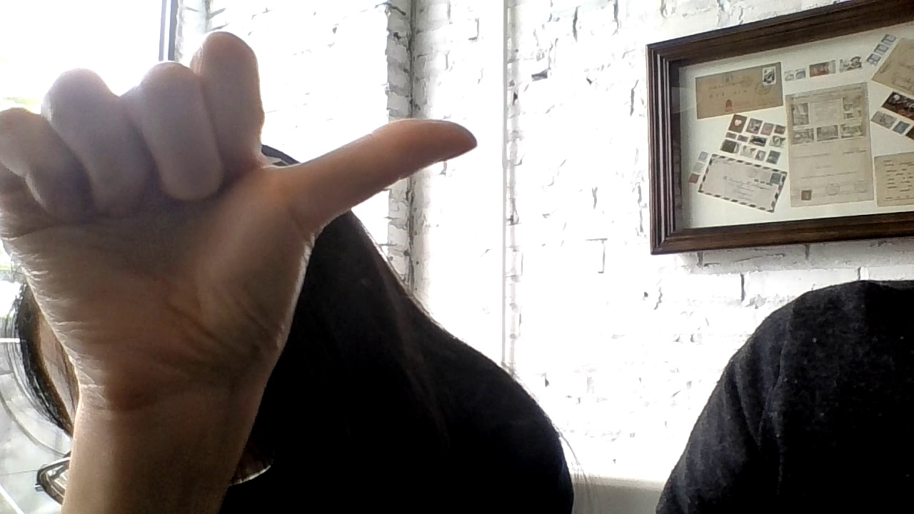

### 'right'
There are 2 right gesture using both left and right hand.  
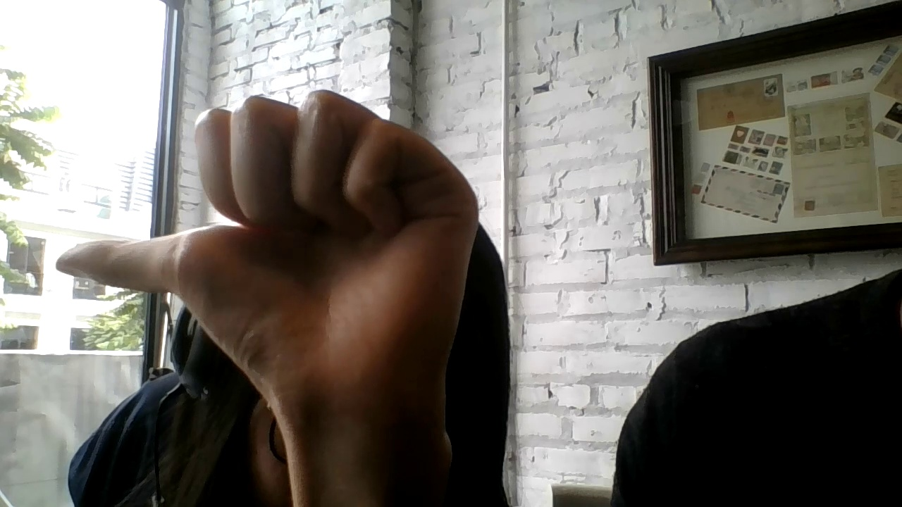
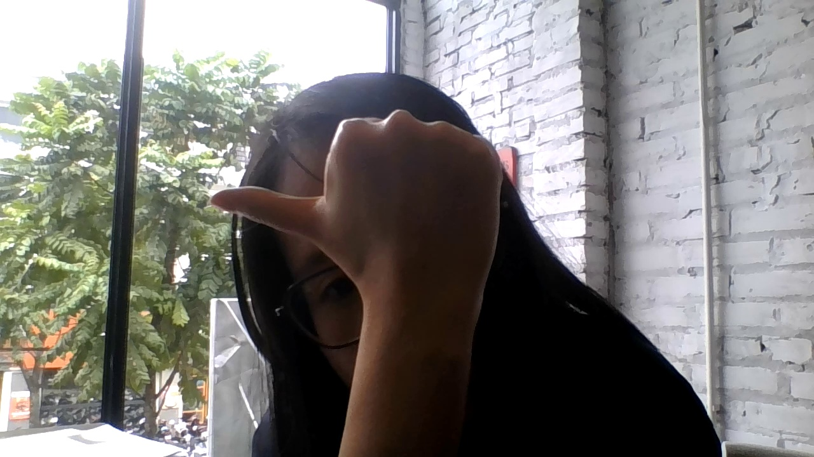

### 'cool'
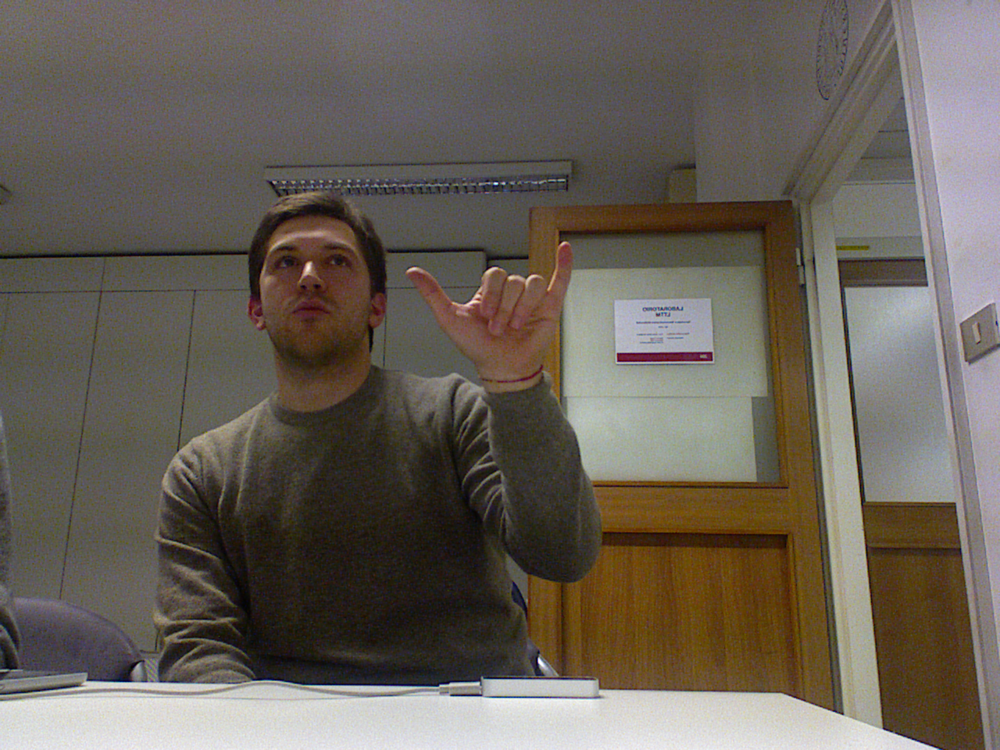

